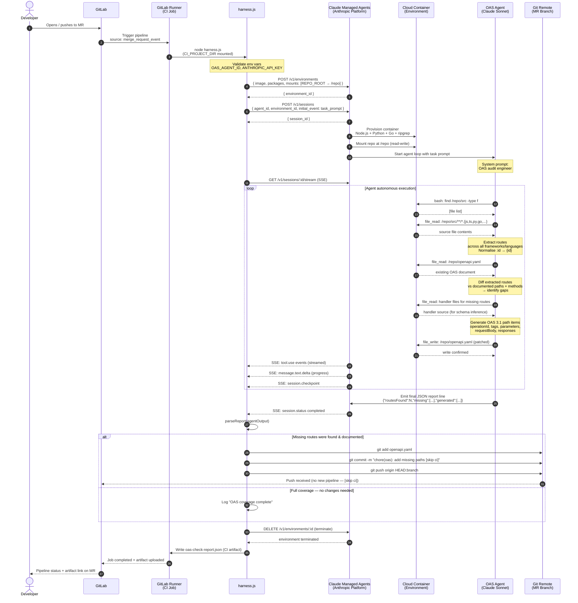
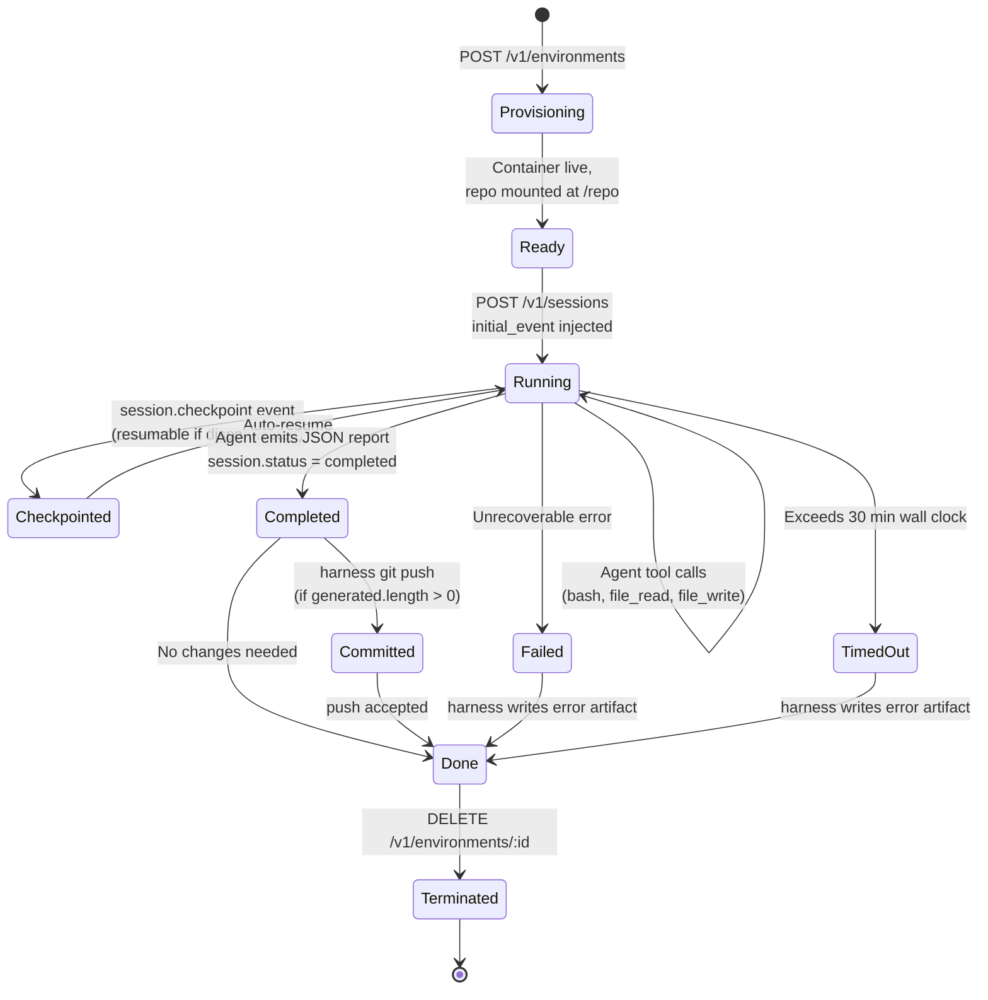
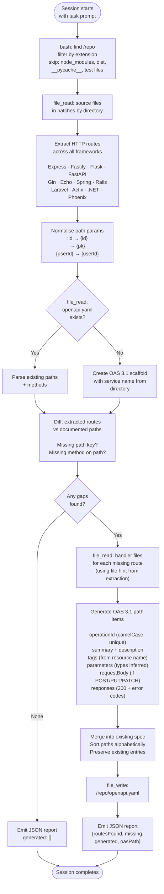
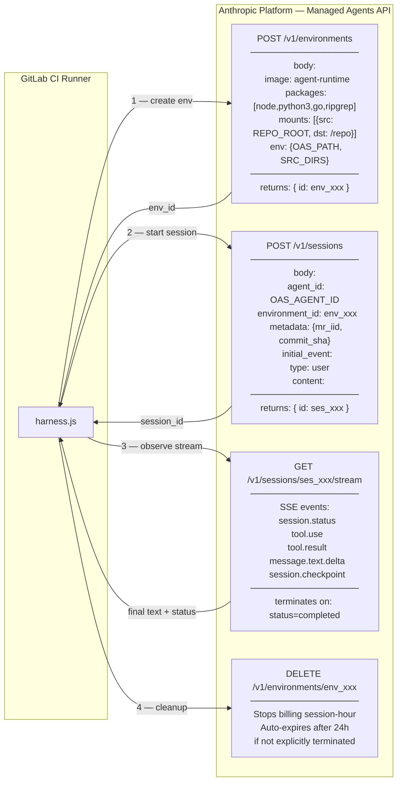
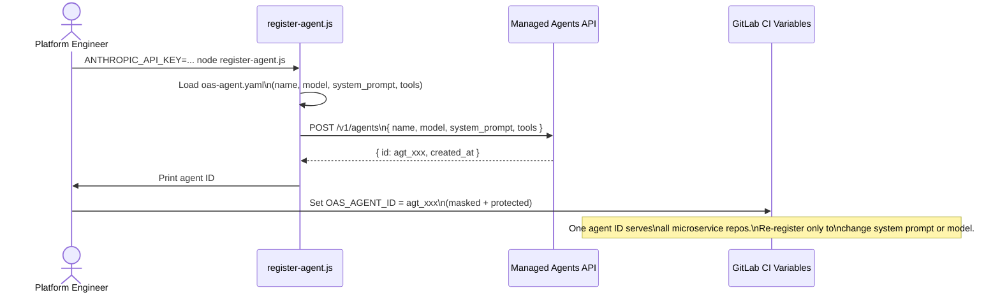

# OAS Coverage Agent — Technical Design Document

**Version:** 2.0  
**Architecture:** Claude Managed Agents  
**Status:** Beta  

> For a high-level summary of components, layers, and design decisions, see [`ARCHITECTURE.md`](../ARCHITECTURE.md) at the repo root. This document contains the detailed Mermaid diagrams, state machines, and API reference.

---

## Overview

When a Merge Request is opened or updated in GitLab, a CI pipeline job automatically audits the microservice codebase for OpenAPI Specification (OAS) coverage. Any HTTP routes implemented in code but absent from `openapi.yaml` are detected and documented by an AI agent running in a cloud-managed container. The patched spec is committed back to the MR branch with no human intervention.

---

## End-to-End Data Flow



---

## Component Breakdown

### Actors & Systems

| Component | Role | Where it runs |
|---|---|---|
| **GitLab** | MR event trigger, pipeline orchestration, artifact storage | GitLab SaaS / self-hosted |
| **GitLab Runner** | Executes the CI job; hosts `harness.js` | Runner VM / Docker executor |
| **harness.js** | Thin lifecycle controller — 3 API calls, no AI logic | Runner process |
| **Claude Managed Agents** | Provisions environments, manages the agent loop, handles checkpointing | Anthropic Platform |
| **Cloud Container (Environment)** | Isolated sandbox with repo mounted; tool execution surface | Anthropic-managed infra |
| **OAS Agent (Claude Sonnet)** | Reads source, extracts routes, diffs OAS, generates and writes entries | Inside managed container |
| **Git Remote** | Receives the patched `openapi.yaml` commit | GitLab repository |

---

## State Machine — Session Lifecycle



---

## Data Flow — Inside the Agent



---

## Harness Sequence — API Calls Detail



---

## CI Variables Reference

| Variable | Required | Scope | Description |
|---|---|---|---|
| `ANTHROPIC_API_KEY` | ✅ | Masked, Protected | Anthropic API key |
| `OAS_AGENT_ID` | ✅ | Masked, Protected | UUID from `register-agent.js` |
| `GITLAB_TOKEN` | ✅ | Masked, Protected | Project access token (`write_repository`) |
| `OAS_PATH` | optional | — | Path to spec file; default `openapi.yaml` |
| `SRC_DIRS` | optional | — | Comma-separated source dirs; default `src,app,lib,routes,api` |
| `OAS_COMMIT_MESSAGE` | optional | — | Commit message for spec updates |

---

## Agent Registration (One-Time Setup)



---

## Artifact Schema

`oas-check-report.json` is uploaded as a GitLab CI artifact on every run:

```json
{
  "success": true,
  "routesFound": 14,
  "missing": [
    "POST /orders",
    "DELETE /orders/{id}",
    "GET /orders/{id}/status"
  ],
  "generated": [
    "/orders",
    "/orders/{id}",
    "/orders/{id}/status"
  ],
  "oasPath": "openapi.yaml",
  "sessionId": "ses_01ABCxyz...",
  "message": "Added 3 missing path(s) to openapi.yaml"
}
```

On full coverage (no changes):

```json
{
  "success": true,
  "routesFound": 14,
  "missing": [],
  "generated": [],
  "oasPath": "openapi.yaml",
  "sessionId": "ses_01ABCxyz...",
  "message": "OAS coverage complete — no changes needed"
}
```

---

## Pricing Model

| Item | Rate | Typical MR run |
|---|---|---|
| Claude Sonnet tokens | Standard API pricing | ~50K–150K tokens |
| Active session runtime | $0.08 / session-hour | 3–8 min active → $0.004–$0.011 |
| Idle time (waiting on tools) | Free | Not billed |
| Total per MR | — | **~$0.01–$0.05** |

---

## Design Decisions

### Why Managed Agents vs DIY harness

The v1 harness owned the agent loop: batching files into 60 KB chunks, managing multi-call orchestration, and implementing error recovery. All of that logic encoded assumptions about what Claude couldn't handle. Those assumptions go stale as models improve.

In v2, the agent decides how to traverse the repo, which files to read, and how to handle large codebases. The harness is reduced to three API calls — environment, session, stream — with no AI logic of its own.

### Why one Agent ID for all repos

The agent definition contains the system prompt and tool configuration but no repo-specific context. All task context is injected at session creation time via the initial user event. This means a single registered agent serves every microservice, every language, every team.

### Why `[skip ci]` on the commit

The agent commits back to the MR branch. Without `[skip ci]`, that push would trigger another pipeline run, creating an infinite loop. The `[skip ci]` token in the commit message instructs GitLab to suppress pipeline creation for that push.

### Why terminate the environment explicitly

Environments are billed by active session-hour. The harness terminates the environment immediately after the session completes to stop the meter. Environments auto-expire after 24 hours as a safety net.
